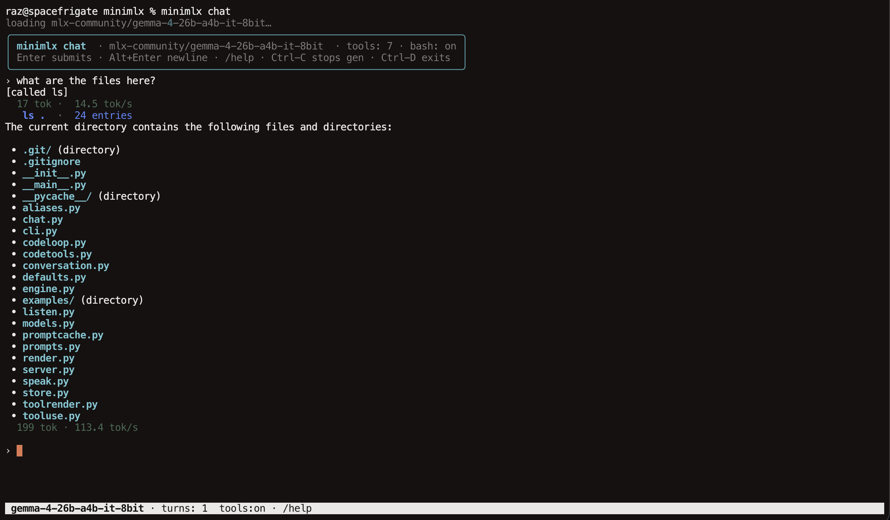

# minimlx

**Very fast macOS CLI for Google Gemma 4 on Apple Silicon via MLX.**

A local LLM command line for Apple Silicon Macs: an interactive chat REPL,
one-shot prompts, an agentic coding loop, and voice conversation — all running
on-device through [MLX](https://github.com/ml-explore/mlx). `minimlx serve` also
exposes an Anthropic-API-compatible endpoint, so you can point Claude Code at a
local model.



## Features

- **Fast on-device inference** — Gemma 4 and Qwen 3.6 on Apple Silicon via MLX,
  with speculative decoding (DFlash block-diffusion drafts and Google
  Multi-Token-Prediction drafters).
- **Interactive chat** — streaming output, reasoning display, and a local
  tool-use loop: read, write, edit, grep, glob, ls, and bash.
- **Agentic `code` command** — one-shot programming tasks with the same tools.
- **Voice conversation** — speak → transcribe → generate → speak, fully local.
- **Claude Code backend** — `minimlx serve` speaks the Anthropic API, so Claude
  Code can run against a local model.
- **Prompt and KV caching**, model aliases, and conversation logging.

## Requirements

- macOS on Apple Silicon (M-series)
- Python 3.11+

## Install

```sh
git clone https://github.com/bravenewxyz/minimlx
cd minimlx
pip install -e .
```

Optional extras:

```sh
pip install -e ".[conversation]"   # voice conversation (STT/TTS)
pip install -e ".[dflash]"         # DFlash speculative-decoding drafts
pip install -e ".[mtp]"            # Google Multi-Token-Prediction drafters
```

## Usage

```sh
minimlx chat                  # interactive chat REPL with tools
minimlx ask "explain crc32"   # one-shot prompt (bare text works too)
minimlx code "add a --json flag"   # one-shot agentic coding task
minimlx conversation          # voice conversation
minimlx serve                 # Anthropic-API server for Claude Code
```

Model and cache management:

```sh
minimlx pull gemma4           # download a model
minimlx models                # list model aliases
minimlx ls                    # list cached models
```

Run `minimlx --help` or `minimlx <command> --help` for all options.

## Using with Claude Code

Start the local server:

```sh
minimlx serve
```

Then point Claude Code at it:

```sh
export ANTHROPIC_BASE_URL=http://127.0.0.1:1234
export ANTHROPIC_AUTH_TOKEN=minimlx
```
